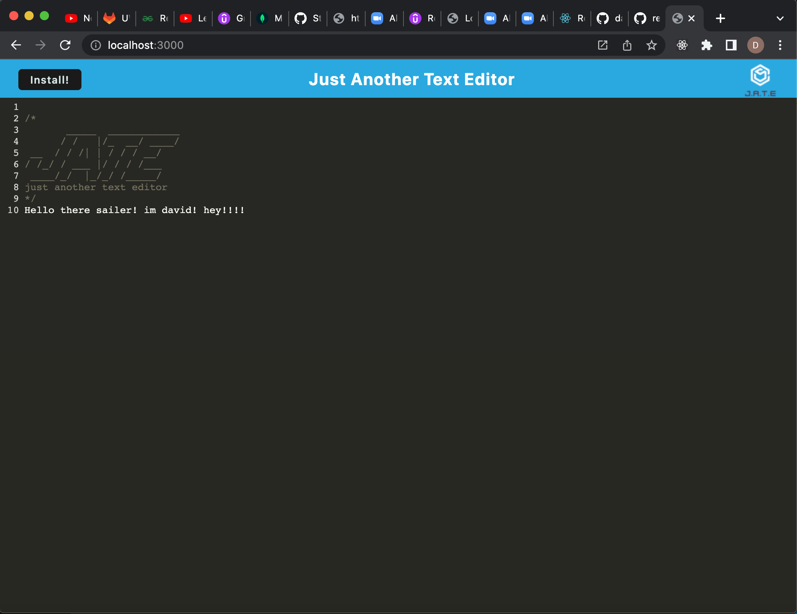
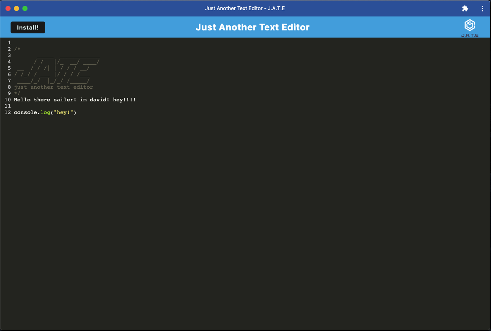

## Text-Editor


## Description
This application is a text editor that allows the user to write notes and code similarly to TextEdit. This app uses IndexedDB which is a local database that allows it to be used offline and make changes to documents. Once connected back to internet, with the help of webpack, the app will be updated with the added changes made offline. 

## Technologies
* Javascript
* Node.js
* Express.js
* Webpack
* Babel
* IndexedDB

## Installation
```npm i ```
```npm start```

## Usage
open the app on the browser and proceed to write your content. 
once content is written, click on the "install" button. this will download the application onto your desktop and allow you to use the offline version.

## Preview




## Author
- GitHub: davidpascual2
- Email: davidpascual200@gmail.com
